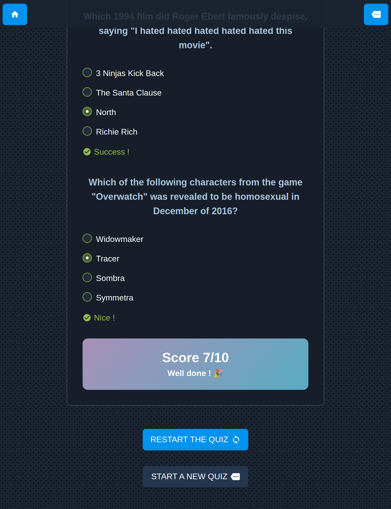
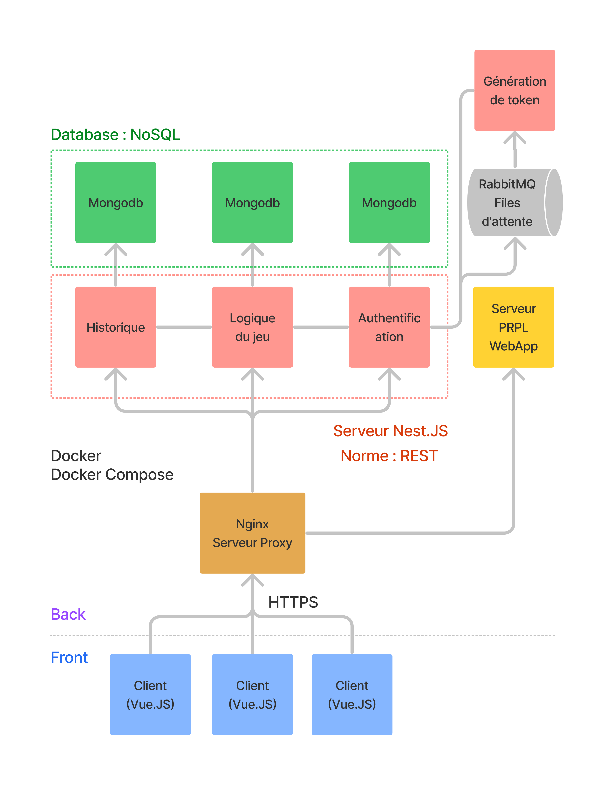

# Dino Quiz


## Groupe

- Marceau David
- Geoffrey Clermont
- Robin Bigeard

## Architecture

- Application : `/app`
- Server Authentication : `/auth`
- Server Quiz : `/quiz`
- Server History : `/history`
- Docker Volumes (mongoDB + Nginx) : `/docker`



## Start project DEV
Instal docker and docker-compose,
then start this commande :
```bash
docker-compose -f docker-compose.dev.yml up
```
Go to this url :
http://localhost (127.0.0.1:80)

## Import database :
Install `mongoimport`
https://docs.mongodb.com/database-tools/installation/installation/

And execute this commande line :
```bash
mongoimport -h="localhost:27018" -d="quiz" -c="questions" --file="./quiz/db.json"
```
Or use `mongodb-compass` to import manually.
File to import : `./quiz/db.json`

## Request API

All API requests are referenced in this file `doc/Insomnia_2021-12-01.json`. 
Just use Insomnia, import it and test ^^.